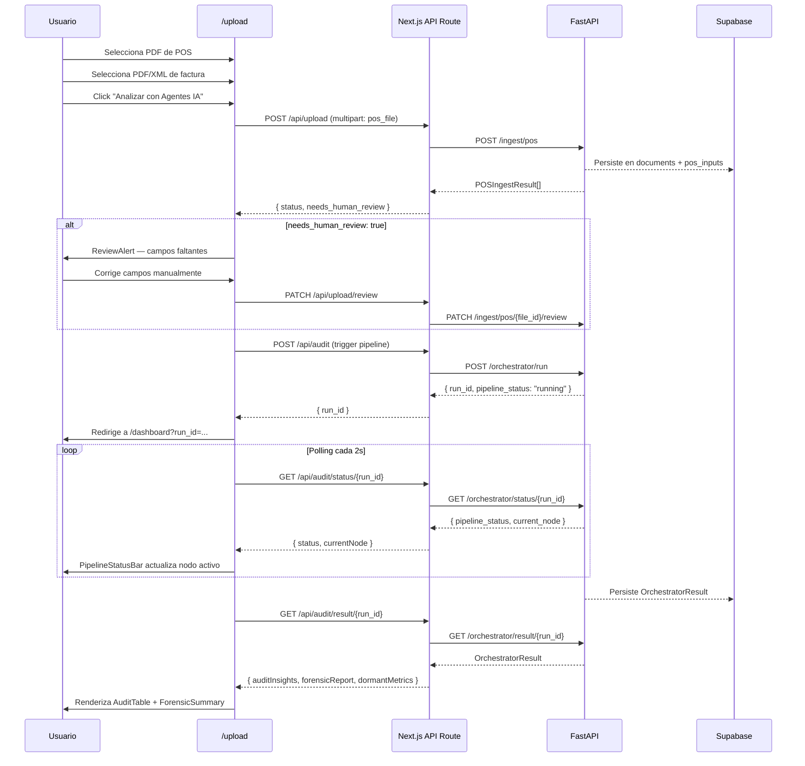

# Diseño Frontend — Flujo de Interacción

**Referenciado desde:** `design.md`

## Flujo completo: ingesta → análisis → pantalla



## Estados de la UI por `pipeline_status`

| `pipeline_status` | PipelineStatusBar | AuditTable | Banner |
|-------------------|-------------------|------------|--------|
| `running` | Animación en nodo activo | Skeleton loader | — |
| `completed` | Todos verdes | Datos reales | Según `risk_level` |
| `partial` | Verdes + grises (dormant) | Datos parciales | Info: métricas faltantes |
| `escalated` | Verdes + indicador Layer 2 | Datos + nota escalación | Warning |
| `failed` | Rojo en nodo fallido | Error state | Error crítico |

## Flujo de `risk_level` → UI

```
ForensicReport.risk_level
  │
  ├── "high"   → Banner rojo fijo en top del dashboard
  │              Filas critical con borde rojo
  │              AnomalyCards en panel lateral
  │
  ├── "medium" → Banner ámbar colapsable
  │              Filas warning con borde ámbar
  │
  └── "low"    → Sin banner
                 Solo métricas dormant en panel lateral
```

## Flujo de `needs_human_review`

```
POST /ingest/pos → POSIngestResult
  │
  ├── needs_human_review: false → continuar al trigger del pipeline
  │
  └── needs_human_review: true
        → ReviewAlert muestra missing_fields
        → Usuario completa campos
        → PATCH /ingest/pos/{file_id}/review
        → Si 200 → continuar al trigger del pipeline
        → Si error → mostrar mensaje específico
```

## Manejo de errores de API

| HTTP | Mensaje en UI | Componente |
|------|---------------|------------|
| 409 | "Faltan datos para iniciar el análisis. Revisa las métricas dormant." | Banner warning |
| 412 | "Completa el onboarding del negocio antes de auditar." | Banner con link |
| 503 | "El servicio de análisis no está disponible." | Banner error |
| 422 | Mensaje específico del campo inválido | Inline en formulario |

## Archivos relacionados de este nodo

- `design_components.md` — componentes que implementan cada estado del flujo
- `design_wireframes.md` — layouts donde ocurren las transiciones
