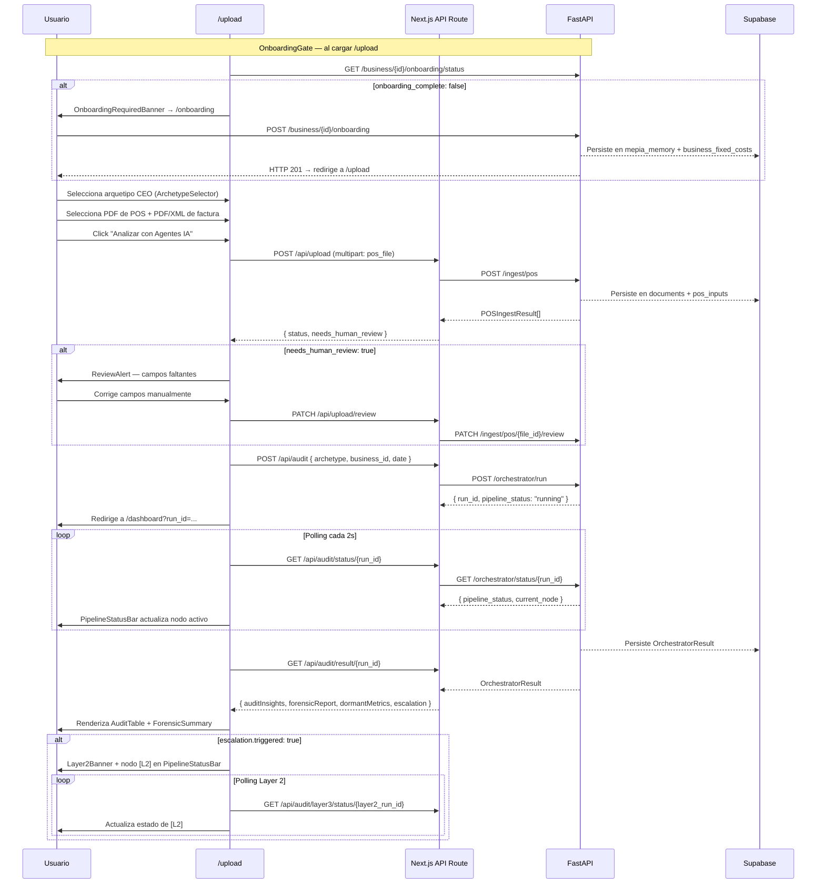

# Diseño Frontend — Diagrama de Secuencia Principal

**Referenciado desde:** `design_flows.md`

## Flujo completo: onboarding → ingesta → análisis → pantalla

## Archivos relacionados de este nodo

- `design_flows.md` — estados de UI, flujos de control y errores
- `design_components.md` — componentes que implementan cada paso
